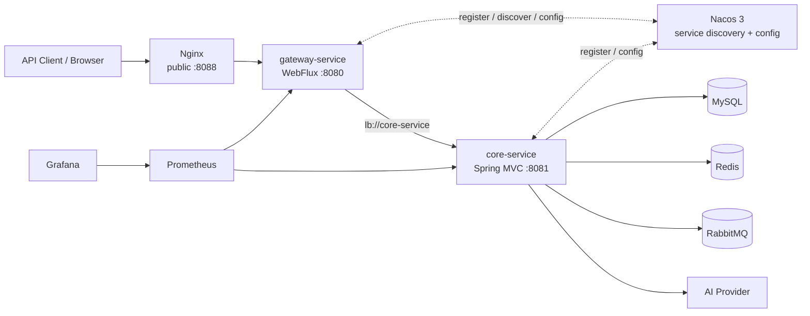
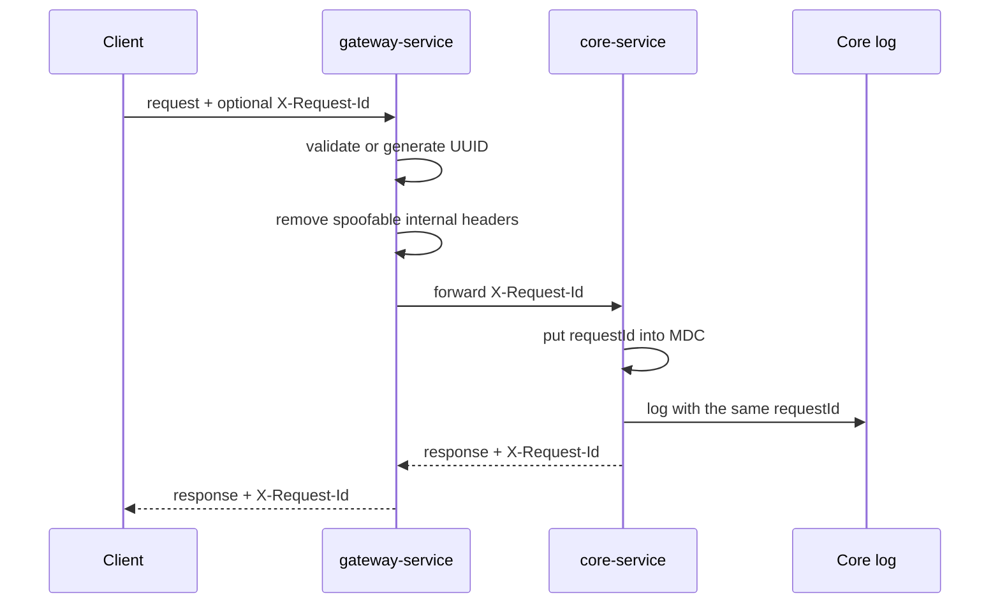
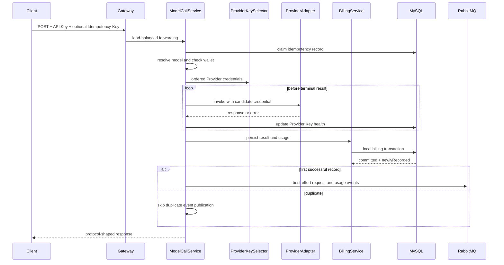
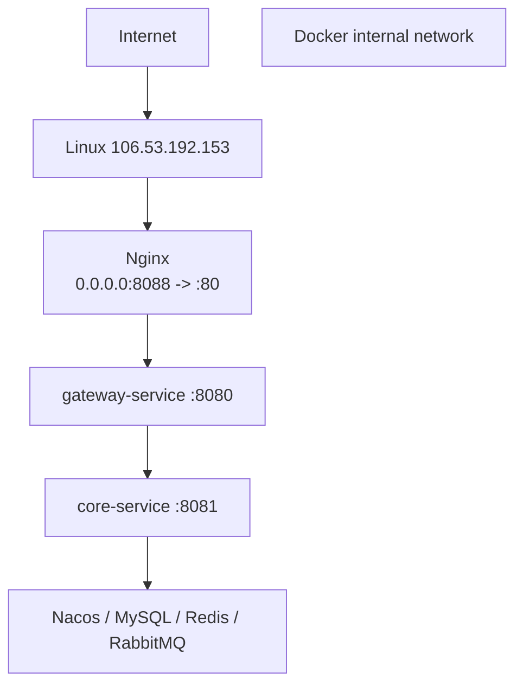

# AI Gateway Architecture

本文描述 `ai-gateway` 当前的服务边界、依赖方向、调用链、数据一致性和部署形态。具体文件与维护入口见 [CODEBASE.md](CODEBASE.md)。

## 1. 架构目标

当前版本不是把单体平均切成多个进程，而是先提取一个独立的边缘网关：

```text
模块化单体
  -> 提取 gateway-service
  -> 保留 core-service 内的强一致业务
  -> 通过 Nacos 完成注册、发现和配置
```

这一步主要解决：

- 客户端只有一个稳定入口；
- 路由和业务实现分离；
- HTTP、SSE、WebSocket 都能按服务名转发；
- 具备真实的服务注册、发现和配置中心实践；
- 两个服务可以独立构建、发布和观察；
- 不破坏现有计费事务与流式调用语义。

## 2. 总体结构



运行时只有 Nginx 对公网提供业务入口。`gateway-service`、`core-service`、Nacos、MySQL、Redis 和 RabbitMQ 位于 Docker 内部网络；管理端口最多绑定到宿主机回环地址。

## 3. 服务职责与依赖方向

### 3.1 `gateway-service`

`gateway-service` 是 Spring Cloud Gateway WebFlux 应用，负责：

- 匹配对外业务路径；
- 从 Nacos 发现 `core-service` 实例；
- 使用 Spring Cloud LoadBalancer 转发请求；
- 保持 HTTP、SSE 和 WebSocket 协议语义；
- 生成、校验和透传 `X-Request-Id`；
- 删除来自公网的 `X-Internal-Token`、`X-User-Id`，避免伪造内部身份；
- 暴露独立的健康检查和 Prometheus 指标。

它不访问数据库，不保存用户、API Key 或钱包数据，也不负责业务鉴权和计费。

### 3.2 `core-service`

`core-service` 是原有 Spring MVC 业务应用，负责：

- 用户、角色、JWT、Refresh Token；
- 平台 API Key 和 Provider Key；
- API Key/JWT 鉴权与 Redis 限流；
- 模型、价格、Provider Key 调度和 failover；
- OpenAI、Anthropic、Responses 请求适配；
- 上游 HTTP/SSE 调用和 Responses WebSocket 会话；
- 幂等、请求日志、用量、钱包扣费和流水；
- RabbitMQ 事件发布与消费者骨架；
- MyBatis 与全部当前业务表；
- 独立健康检查和 Prometheus 指标。

当前依赖方向：

```text
Nginx
  -> gateway-service
  -> core-service
  -> MySQL / Redis / RabbitMQ / Provider
```

禁止让 `core-service` 回调 `gateway-service`。服务发现只用于网关找到核心服务，不启用按服务名自动暴露路由的 Discovery Locator。

## 4. 为什么暂时不继续拆分

### 4.1 Provider 暂不独立

一次 Provider 调用不仅是普通 HTTP 转发，还包含：

- 保留 OpenAI 原始 JSON 中的未知字段；
- 选择、解密并尝试多个 Provider Key；
- 只允许在首个下游可见事件之前切换 Key；
- 把上游流解析成中立事件，再转成三种下游协议；
- SSE/WebSocket 断开、取消和部分用量计费；
- 流结束后才能发送完成事件。

如果立刻独立 Provider 服务，需要先定义稳定的原始 payload、流事件、错误、取消和认证协议。当前这些仍是进程内 Java 类型和回调边界，因此保留在 `core-service`。

### 4.2 Billing 暂不独立

成功计费依赖固定的本地事务顺序：

```text
claim usage_billing_dedup
-> SELECT wallet ... FOR UPDATE
-> validate and update wallet
-> INSERT request_log
-> INSERT usage_record
-> INSERT wallet_transaction
-> UPDATE idempotency_record
-> COMMIT
```

这些表目前都在同一个 MySQL 数据库。拆成独立 Billing 服务会把一个可验证的本地事务转换为分布式事务和跨服务幂等问题。

### 4.3 User 暂不独立

注册同时创建用户、绑定角色并创建钱包；API Key、JWT、钱包查询也共享用户身份。拆分前应先明确用户服务是否拥有钱包初始化、认证数据和 API Key 的职责。

因此当前边界是“边缘网关 + 核心业务服务”，而不是伪装成微服务的多进程共享数据库。

## 5. Spring Cloud 与 Nacos

版本由根 Maven 工程统一管理：

| 组件 | 版本 |
| --- | --- |
| Java | 21 |
| Spring Boot | 3.5.16 |
| Spring Cloud Release Train | 2025.0.3 |
| Spring Cloud Alibaba | 2025.0.0.0 |
| Nacos Server | 3.2.3 |

两个服务都设置固定的 `spring.application.name`，并使用相同的 Nacos 地址。Compose 开启 Nacos 客户端、管理 API 和控制台认证：

```text
gateway-service
core-service
```

配置中心：

| Service | Data ID | Group |
| --- | --- | --- |
| `gateway-service` | `gateway-service.yml` | `AI_GATEWAY` |
| `core-service` | `core-service.yml` | `AI_GATEWAY` |

应用通过 `spring.config.import=optional:nacos:...` 加载配置。`optional:` 允许禁用 Nacos 的单元测试和纯本地逻辑测试启动；Compose 部署会显式启用注册和配置。

Nacos 配置只保存非敏感参数。密码、JWT/Jasypt 密钥和 Provider Key 仍由环境变量或 CI Secret 提供。

生产 Compose 覆盖文件使用必填变量校验，缺少数据库、RabbitMQ、JWT、Jasypt、Nacos 或 Grafana 密钥时拒绝启动。部署流程会在启动业务服务前强制重跑一次 Nacos 配置发布容器，避免复用旧的一次性容器。

## 6. 路由与协议

`gateway-service` 显式声明路由：

| Route | URI | Predicate |
| --- | --- | --- |
| `core-http` | `lb://core-service` | `/api/**`、`/v1/**`、`/chat/**`、`/responses/**`、`/backend-api/codex/**` |
| `core-websocket` | `lb:ws://core-service` | Responses 三个升级路径并且 `Upgrade: websocket` |

WebSocket 路径：

```text
/v1/responses
/responses
/backend-api/codex/responses
```

业务 API 的状态码、错误 JSON、`Retry-After`、鉴权 Header、`Idempotency-Key` 和流式事件由 `core-service` 决定，网关只透明转发。模型 POST 路由不配置自动重试，避免重复上游调用和重复扣费。

## 7. 请求 ID 与信任边界



请求 ID 的约束：

- 只接受 `[A-Za-z0-9._:-]+`；
- 最长 128 字符；
- 缺失或不合法时生成 UUID；
- 每次请求结束后从 MDC 删除，防止线程复用污染下一次请求。

`X-Request-Id` 用于排查，不是认证凭证。客户端传入的 `X-Internal-Token` 和 `X-User-Id` 会在边缘网关删除。

## 8. 非流式模型调用



RabbitMQ 发布发生在数据库事务提交之后。发布异常会记录错误但不会把已扣费的模型调用改判成失败。这保证核心结果优先，但仍存在消息丢失窗口。

## 9. SSE 与 WebSocket

HTTP SSE 和 Responses WebSocket 最终都复用 `ModelCallService`、Provider Key 调度、流事件适配和 `BillingService`。

关键规则：

- 上游事件先转成 `ProviderStreamEvent`，再转为 OpenAI、Anthropic 或 Responses 事件；
- OpenAI 兼容请求设置 `stream_options.include_usage=true`；
- 只在第一个客户端可见事件之前允许切换 Provider Key；
- `[DONE]`、`message_stop`、`response.completed` 在计费事务成功后才发送；
- Provider 未返回完整 usage 时使用估算值并标记 `ESTIMATED`；
- 上游已经输出后失败或客户端断开时，按已经发生的部分 usage 计费；
- WebSocket 升级与双向帧必须由 Nginx、Gateway 和 Core 三层共同保持；
- SSE 三层都必须关闭会聚合事件的代理缓冲，并允许长读取超时。

## 10. 数据归属和一致性

当前全部业务数据仍归 `core-service` 所有：

```text
user_account 1--1 wallet
user_account 1--N api_key
provider 1--N provider_key
provider 1--N model 1--N pricing_rule
provider_key 1--N provider_key_quota_window
request_log 1--0..1 usage_record
wallet 1--N wallet_transaction
api_key 1--N idempotency_record
api_key 1--N usage_billing_dedup
```

数据库约束提供最终保护：

- `usage_billing_dedup(request_id, api_key_id)` 唯一；
- `request_log.request_id` 唯一；
- `usage_record.request_id` 唯一；
- `wallet_transaction(request_id, type)` 唯一；
- 钱包行通过 `SELECT ... FOR UPDATE` 串行扣减。

不能因为新增了服务发现，就让两个服务直接共享和修改同一组业务表。未来如果提取新服务，应先指定表的唯一所有者，并通过 API 或事件访问。

## 11. RabbitMQ 边界

当前 Topic Exchange、持久 Queue、版本化 JSON 事件、生产者和手动 ACK Consumer 已存在。非流式成功链路在首次落库后发布：

```text
request.completed
usage.recorded
```

Consumer 当前只记录事件，尚未生成独立投影。当前发布是 best-effort：

```text
database commit
-> publish events
```

数据库提交后应用退出或 Broker 不可用可能丢事件。后续可靠化顺序应为：

```text
Transactional Outbox
-> publisher confirm / retry
-> consumer idempotency
-> dead-letter queue
```

## 12. 部署与网络



公网入口：

```text
http://106.53.192.153:8088
```

MySQL、Redis、RabbitMQ 和 Nacos 不能发布到 `0.0.0.0`。需要本机诊断的管理端口应绑定 `127.0.0.1`，通过 SSH 隧道访问。

主要容器设置了总计约 2.9 GiB 的内存上限，为 3.6 GiB 主机上的 Linux 和 Docker 保留空间。Prometheus 与 Grafana 使用固定版本镜像，避免无界资源竞争或浮动标签升级造成不可重复部署。

Prometheus 分别抓取：

```text
gateway-service:8080/actuator/prometheus
core-service:8081/actuator/prometheus
```

## 13. CI/CD 与回滚

GitHub Actions 流程：

```text
push / pull request
-> mvn clean verify
-> build gateway-service image
-> build core-service image
-> main push: push both SHA tags
-> erent environment approval
-> SSH deploy with Compose
-> nginx -t and reload
-> local + public health check
```

两个镜像使用同一个 commit SHA。手动 `workflow_dispatch` 接受以前成功发布的 SHA，以同一标签重新部署两个服务，作为最小回滚机制。

## 14. 当前能力边界

- `RefreshTokenService` 使用进程内存；`core-service` 暂时单副本，重启会让旧 Refresh Token 失效。
- Nacos 是 standalone 单节点，Nacos 故障会影响新实例发现和动态配置，不具备生产高可用。
- RabbitMQ 发布是 best-effort，尚无 Outbox、自动补发和完整死信处理。
- `core-service` 仍是一个按包分层的模块化单体，Provider、Billing、User 尚未独立。
- 当前没有服务间独立认证协议；只有网关到核心服务一跳，核心服务也不应直接暴露公网。
- HTTPS 需要域名和真实证书后单独启用。
- 当前服务器资源有限，不以堆叠更多中间件或大量 JVM 为目标。

下一次拆分的前置条件不是“类很多”，而是某个领域已经具备稳定职责、独立数据所有权、清晰 API/事件合同和可独立验证的发布价值。
