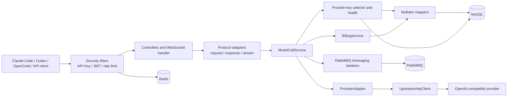
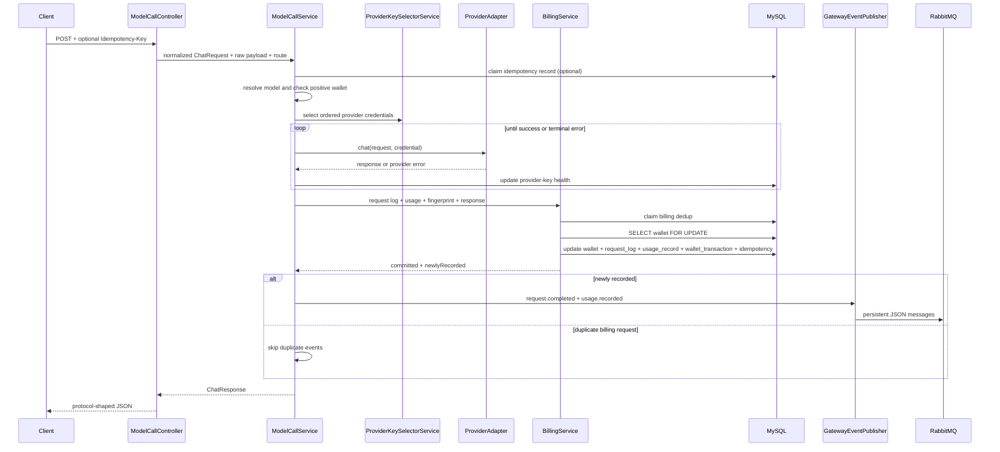
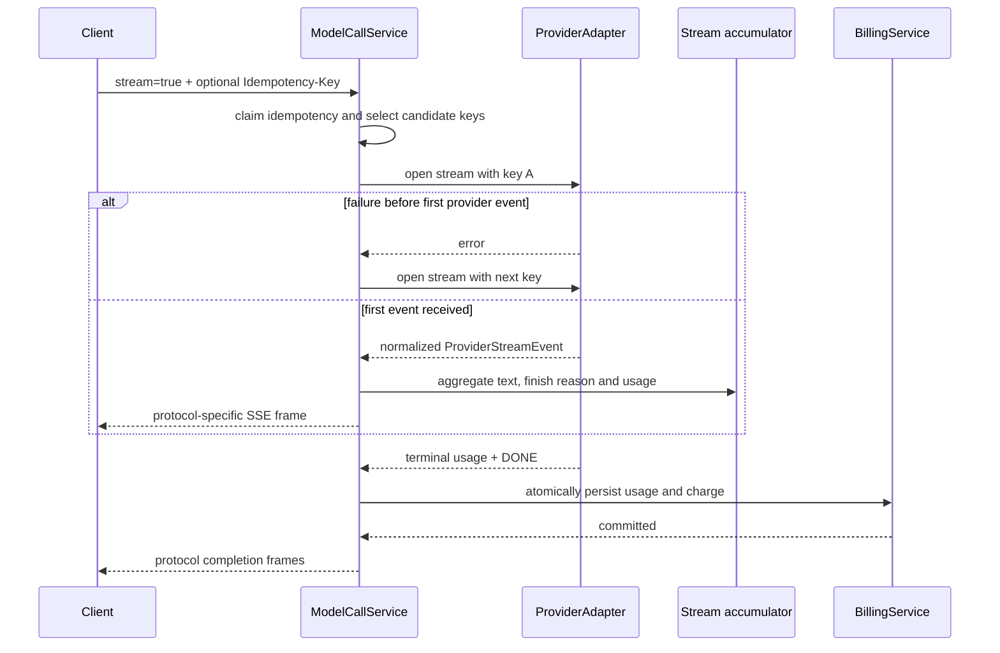
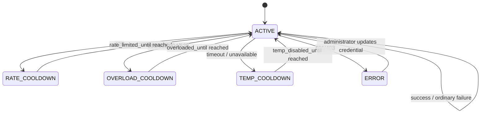

# AI Gateway Architecture

本文描述 `ai-gateway` 的系统边界、模块职责、依赖方向、调用链和一致性约束。具体文件和方法索引见 [CODEBASE.md](CODEBASE.md)。

仓库级维护约束见 [AGENTS.md](AGENTS.md)。任何影响架构、代码结构或能力边界的实现变更，都必须在同一次任务中同步检查并更新本文与 `CODEBASE.md`。

## 1. 系统目标

项目是一个 Spring Boot AI API 中转网关，主要负责：

- 兼容 OpenAI Chat Completions、Anthropic Messages 和 OpenAI Responses HTTP 接口。
- 提供 Responses API WebSocket 模式的基础文本会话续接。
- 使用平台 API Key 鉴权，并通过 Redis 固定窗口限制调用频率。
- 为一次模型调用选择可调度的上游 Provider Key，并在连接建立前故障切换。
- 记录请求、token usage 和实际使用的 Provider Key。
- 根据 `pricing_rule` 计算费用，串行化并发钱包扣减并写入流水。
- 通过 Idempotency-Key、request fingerprint 和扣费去重表防止重复调用及重复扣费。
- 提供 RabbitMQ 事件拓扑、JSON 事件、生产者和手动确认消费者骨架，为后续异步日志与用量统计做准备。

## 2. 技术栈

| 领域 | 技术 |
| --- | --- |
| 应用框架 | Java 21、Spring Boot 3.5 |
| HTTP 服务 | Spring MVC |
| 上游异步客户端 | Spring WebFlux `WebClient`、Reactor |
| WebSocket | Spring WebSocket |
| 安全 | Spring Security、JWT、平台 API Key |
| 数据访问 | MyBatis XML、MySQL |
| 限流 | Redis Lua 固定窗口 |
| 异步消息 | RabbitMQ、Spring AMQP（当前接入非流式成功链路） |
| Provider Key | 应用层加密、调用时解密、数据库状态调度 |
| JSON 幂等 | RFC 8785/JCS canonicalization、SHA-256 |
| 测试 | JUnit 5、Mockito、Spring Test、Testcontainers 依赖 |

Spring MVC 负责下游 HTTP/SSE；WebFlux 只用于非阻塞上游调用。数据库事务属于阻塞 I/O，流事件在进入计费和 MyBatis 逻辑前切换到 Reactor `boundedElastic`。

## 3. 总体结构



## 4. 分层职责

| 层 | 包 | 职责 |
| --- | --- | --- |
| 入口层 | `controller`, `gateway.websocket` | 路由、认证主体提取、HTTP/SSE/WebSocket 生命周期 |
| 协议层 | `gateway`, `gateway.stream` | 三种请求格式归一化，非流式响应和流事件格式化 |
| 应用层 | `service` | 模型解析、幂等、Key 选择、调用编排、usage 聚合、计费 |
| Provider 层 | `provider`, `client` | Provider 能力抽象、请求构造、上游 HTTP/SSE、错误保真 |
| 安全层 | `security`, `config` | API Key、JWT、密码、Provider Key 加密和 Spring Security 配置 |
| 限流层 | `ratelimit` | API Key、用户和 IP 三维固定窗口限流 |
| 消息层 | `messaging`, `messaging.event`, `messaging.consumer` | RabbitMQ Topic 拓扑、版本化 JSON 事件、持久消息发布和手动 ACK 消费骨架 |
| 持久化层 | `entity`, `mapper`, `resources/mapper` | 数据实体、Mapper 接口和 SQL |
| 数据定义 | `sql` | 全量 schema、种子数据和增量迁移 |

依赖方向保持为：入口层 -> 协议/应用层 -> Provider/持久化层。Mapper 不依赖 Service，Provider Adapter 不负责钱包或用户业务。

## 5. 入口与认证

管理接口位于 `/api/auth/**`、`/api/users/**`、`/api/api-keys/**` 等路径，使用 JWT。模型网关接口使用平台 API Key，接受：

- `Authorization: Bearer <platform-api-key>`
- `x-api-key: <platform-api-key>`
- `x-goog-api-key: <platform-api-key>`

网关请求经过：

```text
ApiKeyAuthFilter
  -> ApiKeyRateLimitFilter
  -> ModelCallController / ResponsesWebSocketHandler
```

限流同时检查 API Key、用户和来源 IP。任一维度超限即返回 `429`；Redis 异常时是否放行由 `gateway.rate-limit.fail-open` 决定。

## 6. 非流式调用链



只有鉴权、模型、钱包和 Provider Key 都通过后才访问上游。Provider 返回成功后才根据实际 usage 扣费。RabbitMQ 发布发生在核心事务提交之后；`AmqpException` 只记录错误，不会把已成功扣费的调用改判为失败。当前发布仍是 best-effort，数据库提交后进程退出或 Broker 不可用可能造成消息丢失，后续由 Transactional Outbox 解决。

## 7. HTTP SSE 流式调用链

流式入口和非流式入口使用相同的 fingerprint、Provider Key 调度和 `BillingService`。不同之处是响应按事件增量输出。



关键规则：

- OpenAI-compatible 上游请求自动设置 `stream_options.include_usage=true`。
- 上游事件先解析成 `ProviderStreamEvent`，再转换为 OpenAI、Anthropic 或 Responses 事件。
- OpenAI Chat Completions 原始 JSON chunk 会原样透传，避免丢失未知字段。
- `[DONE]`、`message_stop`、`response.completed` 在计费事务成功后才发送。
- Provider 未返回完整 usage 时，使用字符数约除以 4 的估算值，并在 `usage_record.usage_source` 标记 `ESTIMATED`。
- 上游已输出部分事件后失败或客户端断开，会按已发生的部分 usage 计费，幂等记录标记为 `FAILED`。
- 只有第一个下游可见事件出现前才能切换 Provider Key；已经输出后禁止跨 Key 拼接响应。
- 完成流会把实际发送的 SSE frames 连同聚合响应存入幂等结果，重复请求可精确重放而不再访问上游或扣费。

## 8. Responses WebSocket

`ResponsesWebSocketConfig` 在以下地址注册升级处理器：

```text
/v1/responses
/responses
/backend-api/codex/responses
```

客户端在已认证连接上发送 `response.create` JSON。`ResponsesWebSocketHandler` 将其转换为内部 `ChatRequest`，并使用 `GatewayStreamSink` 复用 SSE 的调用、usage 和计费链路。WebSocket 发送的是 Responses JSON 事件本身，不包含 SSE 的 `event:`/`data:` 文本前缀。

每个连接一次只允许一个正在生成的 response。连接内会保留上一轮文本历史和 `response_id`，允许下一轮使用 `previous_response_id` 追加输入；生成失败时该连接内历史会失效，连接断开时也会取消仍在运行的 Provider 流并释放状态。

## 9. Provider Key 调度

候选 SQL 只选择同时满足以下条件的 Key：

- `enabled = true`
- `status = ACTIVE`
- `schedulable = true`
- 未过期
- 不在 rate-limit、overload 或 temporary-disable 冷却期
- 没有尚未 reset 且已耗尽的 quota window

排序顺序：用户自有 Key -> `priority` 升序 -> 最久未使用 -> `id`。



冷却状态通过时间字段过滤，而不是反复切换 `enabled`。`enabled` 表示人工开关，`schedulable` 表示是否可参与调度，`status=ERROR` 表示需要人工处理。

## 10. 幂等与扣费一致性

request fingerprint 由以下内容生成：

```text
SHA-256(
  HTTP method + route + API-key scope + JCS-canonicalized JSON payload
)
```

`Idempotency-Key` 本身只保存 SHA-256，不保存明文。`idempotency_record` 的 `(scope, idempotency_key_hash)` 唯一约束保证只有一个请求获得执行权。

扣费事务遵循固定顺序：

```text
claim usage_billing_dedup
-> SELECT wallet ... FOR UPDATE
-> validate balance
-> UPDATE wallet
-> INSERT request_log
-> INSERT usage_record
-> INSERT wallet_transaction
-> UPDATE idempotency_record
-> COMMIT
```

数据库约束提供第二道保护：

- `usage_billing_dedup(request_id, api_key_id)` 唯一：同一业务调用只扣一次。
- `request_log.request_id` 唯一：一条调用只有一个终态日志。
- `usage_record.request_id` 唯一：一条调用只有一条 usage。
- `wallet_transaction(request_id, type)` 唯一：同类钱包流水不能重复。
- 钱包行锁：并发扣减不能同时基于旧余额计算。

## 11. 数据模型关系

核心关系如下：

```text
user_account 1--1 wallet
user_account 1--N api_key
provider 1--N provider_key
provider 1--N model 1--N pricing_rule
provider_key 1--N provider_key_quota_window
request_log 1--0..1 usage_record (via request_id)
wallet 1--N wallet_transaction
api_key 1--N idempotency_record
api_key 1--N usage_billing_dedup
```

`request_log.provider_key_id` 和 `usage_record.provider_key_id` 保存最终实际使用的上游 Key，便于成本、错误率和额度分析。

## 12. 配置边界

主要配置位于 `application.yml`：

- `spring.datasource.*`：MySQL。
- `spring.data.redis.*`：Redis。
- `spring.rabbitmq.*`：RabbitMQ 连接以及 listener 手动确认、prefetch 和并发参数；均可通过 `RABBITMQ_*` 环境变量覆盖。
- `gateway.rate-limit.*`：固定窗口参数。
- `gateway.upstream.*`：连接、读、响应和事件间超时。
- `gateway.provider-key.max-failover-attempts`：单次调用最多候选 Key 数。
- `providers.*`：Provider 默认 base URL 和环境变量回退。
- `JASYPT_PASSWORD`：Provider Key 加密主密码，生产环境必须显式提供。
- `JWT_SECRET`：JWT 签名密钥，生产环境不能使用默认值。

## 13. 扩展方式

新增 Provider：

1. 实现 `ProviderAdapter`。
2. 在 `providerCodes()` 注册代码。
3. 将非流式响应映射为 `ChatResponse`。
4. 将流式响应映射为 `ProviderStreamEvent`。
5. 在 `data.sql`/管理数据中增加 provider、model 和 pricing rule。

新增下游流协议：

1. 在 `GatewayStreamProtocol` 增加枚举。
2. 在 `GatewayStreamResponseAdapter.Session` 增加事件映射。
3. 控制器或新传输使用 `ModelCallService.streamToSink()`。

新增 Provider Key 类型策略时，应把额度探测、认证头和 base URL 规则放在独立策略中，不要把类型分支继续堆入 `ModelCallService`。

## 14. 当前边界

- `OpenAiAdapter` 和 OpenRouter 路径已实现；原生 `ClaudeAdapter`、`GeminiAdapter` 仍是明确的占位实现。
- Anthropic Messages 和 Responses 的当前兼容层以文本消息为主；完整原生工具调用、多模态内容和所有事件类型仍需分别建模。
- `provider_key_quota_window` 已参与调度过滤，但尚无按 Provider 类型自动同步 5 小时/周额度的后台任务。
- WebSocket `previous_response_id` 只在当前连接内保存文本历史，不提供跨进程或断线恢复。
- usage 估算是 Provider 不返回 usage 时的保底方案，不能代替官方 tokenizer 或 Provider 账单对账。
- RabbitMQ 当前接入非流式成功请求：只有首次完成 billing dedup 和核心事务时，`ModelCallService` 才 best-effort 发布 `request.completed` 与 `usage.recorded`；Consumer 仍只记录日志，不写数据库。流式成功/失败事件、Confirm、重试、死信、幂等消费和 Outbox 尚未实现。

## 15. 验证策略

- 纯单元测试覆盖 fingerprint、计费去重、固定窗口、Provider Key 状态、非流式 failover、流式 failover、usage 聚合、三种 SSE 协议和 WebSocket 续接。
- `UserMapperIntegrationTest` 使用 MySQL Testcontainer；Docker 不可用时由 JUnit 明确跳过。
- `RabbitMessagingSkeletonTest` 在不连接 Broker 的情况下验证持久拓扑、发布路由/消息持久属性和手动 ACK。
- 修改数据库结构时同时更新 `sql/schema.sql` 和对应日期的幂等迁移脚本。
- 修改流式协议时至少验证事件顺序、终止事件、usage、错误事件和幂等重放。
