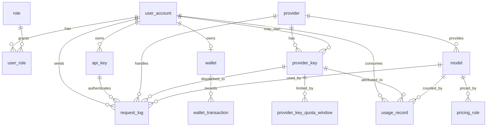

# Database Design

本文档说明 AI API 聚合网关第一版数据库设计。当前数据库主线是：用户创建平台 API Key，通过网关调用上游 Provider 模型，系统记录请求日志、用量记录，并从用户钱包扣费。

## 核心关系

关系说明：

- `user_account` 是平台用户主表。
- `role` 和 `user_role` 表示用户角色，一个用户可以有多个角色。
- `api_key` 是平台发给用户调用网关的 Key，属于某个用户。
- `provider` 是上游 AI 服务商，例如 OpenAI、Claude、Gemini。
- `provider_key` 是调用上游 Provider 所需的 Key，可以是平台级 Key，也可以是用户自己的 Key。
- `model` 属于某个 Provider。
- `pricing_rule` 属于某个模型，用于计算用量费用。
- `wallet` 保存用户当前余额。
- `wallet_transaction` 保存钱包每一次充值、扣费或退款流水。
- `request_log` 保存每一次网关请求的审计信息。
- `usage_record` 保存成功调用后的 token 用量和费用。

## 表说明

### user_account

平台用户表。

| 字段 | 含义 |
| --- | --- |
| `id` | 用户主键 |
| `username` | 用户名，唯一 |
| `password_hash` | 用户密码哈希，不能保存明文密码 |
| `email` | 邮箱 |
| `enabled` | 用户是否启用 |
| `created_at` | 创建时间 |
| `updated_at` | 更新时间 |

关键约束：

- `username` 有唯一索引，防止重复注册。
- `password_hash` 后续应保存 BCrypt 哈希。

### role

角色表。

| 字段 | 含义 |
| --- | --- |
| `id` | 角色主键 |
| `code` | 角色编码，例如 `USER`、`ADMIN` |
| `name` | 角色名称 |

关键约束：

- `code` 唯一。

### user_role

用户和角色的多对多关系表。

| 字段 | 含义 |
| --- | --- |
| `user_id` | 用户 ID |
| `role_id` | 角色 ID |

关键约束：

- 复合主键是 `(user_id, role_id)`，同一个用户不能重复绑定同一个角色。
- `user_id` 外键引用 `user_account(id)`。
- `role_id` 外键引用 `role(id)`。

### api_key

平台 API Key 表。用户调用网关时使用平台 API Key，不直接暴露用户密码。

| 字段 | 含义 |
| --- | --- |
| `id` | API Key 主键 |
| `user_id` | 所属用户 |
| `name` | 用户给 Key 起的名称 |
| `key_hash` | API Key 哈希值 |
| `prefix` | Key 前缀，用于页面展示和排查 |
| `enabled` | 是否启用 |
| `last_used_at` | 最近使用时间 |
| `created_at` | 创建时间 |
| `updated_at` | 更新时间 |

关键约束：

- `key_hash` 唯一，防止两个 Key 对应同一份哈希。
- `user_id` 有普通索引，方便查询某个用户的 Key 列表。
- 数据库只保存 `key_hash`，完整明文 Key 只在创建时展示一次。

### provider

上游 AI 服务商表。

| 字段 | 含义 |
| --- | --- |
| `id` | Provider 主键 |
| `code` | Provider 编码，例如 `OPENAI` |
| `name` | Provider 名称 |
| `enabled` | 是否启用 |
| `created_at` | 创建时间 |

关键约束：

- `code` 唯一。

### provider_key

上游 Provider Key 表，用于保存调用上游 AI 服务商所需的密钥。

| 字段 | 含义 |
| --- | --- |
| `id` | Provider Key 主键 |
| `provider_id` | 所属 Provider |
| `user_id` | 所属用户，为空表示平台级 Key |
| `provider_key_type` | `OFFICIAL_API_KEY`、订阅反代或第三方中转等类型 |
| `base_url` | 该 Key 独立的上游地址，为空时使用 Provider 默认地址 |
| `encrypted_key` | 加密后的 Provider Key |
| `key_hint` | Key 提示信息，例如尾号或备注 |
| `enabled` | 是否启用 |
| `status` | `ACTIVE` 或需要人工处理的 `ERROR` |
| `schedulable` | 是否参与自动调度 |
| `priority` | 调度优先级，数值越小越优先 |
| `rate_limited_until` | 429 冷却截止时间 |
| `overloaded_until` | 上游过载冷却截止时间 |
| `temp_disabled_until` | 超时/网络异常临时禁用截止时间 |
| `expires_at` | 凭证过期时间 |
| `last_error_code` | 最近错误编码 |
| `last_error_message` | 最近错误摘要 |
| `last_used_at` | 最近尝试调用时间 |
| `last_success_at` | 最近成功时间 |
| `last_failed_at` | 最近失败时间 |
| `created_at` | 创建时间 |
| `updated_at` | 更新时间 |

关键约束：

- `provider_id` 外键引用 `provider(id)`。
- `user_id` 可以为空。为空表示平台统一配置的 Provider Key。
- `encrypted_key` 必须加密存储，不能保存明文。

### provider_key_quota_window

Provider Key 的多周期额度窗口。一个 Key 可以同时存在 5 小时、周额度或其他 Provider 自定义窗口。

| 字段 | 含义 |
| --- | --- |
| `provider_key_id` | 所属 Provider Key |
| `window_type` | 窗口类型，例如 `FIVE_HOUR`、`WEEKLY` |
| `quota_limit` | 当前周期总额度 |
| `quota_used` | 当前周期已用额度 |
| `window_start_at` | 周期开始时间 |
| `reset_at` | 周期重置时间 |
| `status` | 窗口状态 |

`(provider_key_id, window_type)` 唯一。尚未重置且 `quota_used >= quota_limit` 的窗口会阻止该 Key 被调度。

### model

模型表。

| 字段 | 含义 |
| --- | --- |
| `id` | 模型主键 |
| `provider_id` | 所属 Provider |
| `code` | 模型编码 |
| `display_name` | 展示名称 |
| `enabled` | 是否启用 |
| `created_at` | 创建时间 |

关键约束：

- `(provider_id, code)` 唯一。不同 Provider 可以有同名模型，同一 Provider 下模型编码不能重复。

### pricing_rule

模型价格规则表。

| 字段 | 含义 |
| --- | --- |
| `id` | 价格规则主键 |
| `model_id` | 所属模型 |
| `input_token_price` | 输入 token 单价 |
| `output_token_price` | 输出 token 单价 |
| `currency` | 币种，当前默认 `CNY` |
| `enabled` | 是否启用 |
| `created_at` | 创建时间 |

使用方式：

- 成功调用模型后，根据 `input_tokens`、`output_tokens` 和当前启用的 `pricing_rule` 计算费用。
- 后续如果价格变更，可以新增一条规则并禁用旧规则，避免直接覆盖历史价格。

### wallet

用户钱包表，只保存当前余额。

| 字段 | 含义 |
| --- | --- |
| `id` | 钱包主键 |
| `user_id` | 所属用户 |
| `balance` | 当前余额 |
| `created_at` | 创建时间 |
| `updated_at` | 更新时间 |

关键约束：

- `user_id` 唯一，一个用户只有一个钱包。
- 扣费时需要在事务中锁定钱包行，避免并发扣成负数。

### wallet_transaction

钱包流水表，保存余额变化历史。

| 字段 | 含义 |
| --- | --- |
| `id` | 流水主键 |
| `wallet_id` | 所属钱包 |
| `type` | 流水类型，例如 `RECHARGE`、`USAGE_DEDUCT`、`REFUND` |
| `amount` | 变动金额，充值为正数，扣费为负数 |
| `balance_after` | 本次变动后的余额 |
| `request_id` | 关联请求 ID，可为空 |
| `created_at` | 创建时间 |

为什么余额表和流水表分开：

- `wallet` 负责快速读取当前余额。
- `wallet_transaction` 负责审计和对账。
- 如果只保存余额，无法追踪钱是怎么变化的。
- 如果只保存流水，每次查余额都要聚合，性能和并发控制都会更复杂。

### request_log

请求日志表，保存每次网关调用的审计信息。

| 字段 | 含义 |
| --- | --- |
| `id` | 日志主键 |
| `request_id` | 请求唯一 ID |
| `user_id` | 发起请求的用户 |
| `api_key_id` | 本次请求使用的平台 API Key |
| `provider_id` | 上游 Provider |
| `provider_key_id` | 最终实际使用的 Provider Key |
| `model_id` | 调用模型 |
| `status_code` | 网关或上游响应状态码 |
| `latency_ms` | 请求耗时，单位毫秒 |
| `error_code` | 错误编码，成功时为空 |
| `created_at` | 创建时间 |

关键约束：

- `request_id` 唯一，便于追踪一次完整调用。
- `(user_id, created_at)` 有联合索引，适合“按用户分页查询请求日志”。
- 请求日志中不能保存完整 API Key、Authorization Header、Provider Key 或密码。

### usage_record

用量记录表，记录成功调用以及流式失败前已经实际发生并计费的部分用量。

| 字段 | 含义 |
| --- | --- |
| `id` | 用量主键 |
| `request_id` | 请求唯一 ID |
| `user_id` | 消费用户 |
| `model_id` | 调用模型 |
| `provider_key_id` | 最终实际使用的 Provider Key |
| `input_tokens` | 输入 token 数 |
| `output_tokens` | 输出 token 数 |
| `total_tokens` | 总 token 数 |
| `usage_source` | `PROVIDER`、`ESTIMATED` 或 `MISSING` |
| `cost_amount` | 本次调用费用 |
| `created_at` | 创建时间 |

使用方式：

- 成功请求写入 `usage_record` 并扣费。
- 流式请求在已经收到 Provider 事件后失败或断开时，写入部分 usage 并扣除已发生费用。
- 第一个 Provider 事件前失败时只写 `request_log`，不扣费。
- `usage_record`、`wallet_transaction`、余额更新、请求日志和幂等终态位于同一个事务中。

## 常用查询场景

- 新增用户：写入 `user_account`，同时初始化 `wallet`。
- 创建平台 API Key：写入 `api_key`，只保存 Key 哈希和前缀。
- 绑定 Provider Key：写入 `provider_key`，只保存加密后的密钥。
- 查询用户钱包余额：按 `wallet.user_id` 查询 `balance`。
- 查询模型价格：`provider`、`model`、`pricing_rule` 关联查询。
- 按用户分页查询请求日志：按 `request_log.user_id` 和 `created_at` 查询。
- 按日期查询消费流水：按 `wallet_transaction.wallet_id` 和 `created_at` 查询。
- 查询用户每日调用次数和消费金额：按 `usage_record.user_id` 和 `DATE(created_at)` 聚合。
- 查询每个模型调用量、错误率和平均耗时：按 `request_log.model_id` 聚合。

## 索引设计

当前第一版重点索引：

- `user_account(username)`：用户名唯一查询和重复注册检查。
- `api_key(key_hash)`：API Key 鉴权时按哈希查找。
- `api_key(user_id)`：查询用户的 API Key 列表。
- `model(provider_id, code)`：查询某 Provider 下指定模型。
- `wallet(user_id)`：一个用户一个钱包，快速查余额。
- `request_log(user_id, created_at)`：按用户分页查询请求日志。
- `usage_record(user_id, created_at)`：按用户和日期统计用量。
- `wallet_transaction(wallet_id, created_at)`：按钱包和时间查询流水。

## 敏感字段原则

不能明文存储：

- 用户密码。
- 平台 API Key。
- Provider Key。
- JWT、Authorization Header、Refresh Token。

字段处理方式：

- `user_account.password_hash`：只保存密码哈希，后续使用 BCrypt。
- `api_key.key_hash`：只保存平台 API Key 哈希，明文只展示一次。
- `api_key.prefix`：只保存非敏感前缀，用于用户识别和排查。
- `provider_key.encrypted_key`：保存加密后的 Provider Key。
- `provider_key.key_hint`：只保存提示信息，不能保存完整 Key。
- `request_log`：只记录请求归属、状态码、耗时和错误编码，不记录完整密钥。

## 测试数据

`sql/data.sql` 提供本地开发测试数据：

- 用户：`hdw`、`alice`、`bob`、`carol`、`dave`、`admin`。
- 角色：`USER`、`ADMIN`。
- Provider：`OPENAI`、`CLAUDE`、`GEMINI`。
- 模型：`gpt-4.1-mini`、`gpt-4.1`、`claude-3-5-sonnet`、`gemini-1.5-flash`、`gemini-1.5-pro`。
- 钱包：包含正常余额、低余额和零余额用户。
- API Key：包含启用和禁用状态。
- 请求日志：包含成功、上游失败、限流、余额不足、Key 禁用等场景。
- 用量记录和钱包流水：用于测试聚合统计、扣费和对账。

注意：当前测试用户的 `password_hash` 是占位值，后续实现登录和 BCrypt 后需要替换成真实可验证的 BCrypt 哈希。
